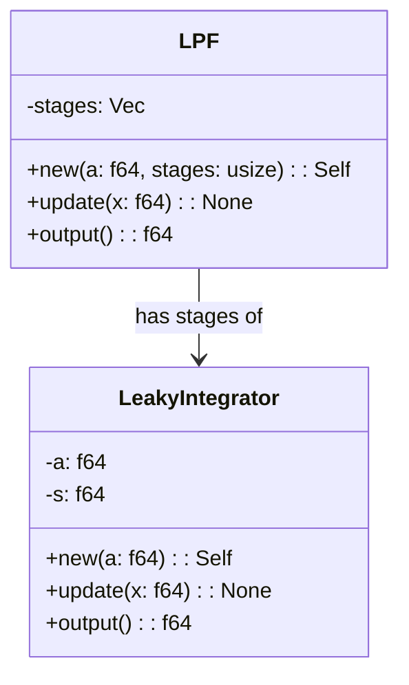

# Rust Low Pass Filter

This repository contains a trivial, yet efficient implementation of a Low-Pass Filter (LPF) written in Rust. The program uses a decoupled architecture and the Chain of Responsibility design pattern.



Here, each `LeakyIntegrator` class represents a stage in the filter, with the `LPF` class aggregating the stages for final output. The example uses this architecture effectively to filter a given dataset.

## Running the Project

Ensure that you have a Rust environment set up on your machine. If not, visit [the official Rust website](https://www.rust-lang.org/) to set it up.

- Clone the repository:

```bash
git clone https://github.com/username/rust-low-pass-filter.git
```

- Navigate to the project directory:

```bash
cd rust-low-pass-filter
```

- Compile and run the program using Cargo:

```bash
cargo run
```

This command will compile the code and display the output for the provided dataset.
